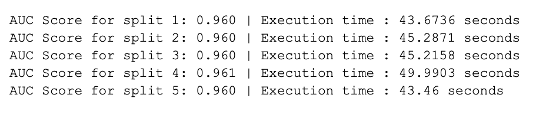

# Overview
In this project, we conducted sentiment analysis with a classification model using the dataset of IMDB movie reviews.
# Team Members:
Qi Zhou,
Yogananth Mahalingam,
Derek Zhang
# Data Pre-Processing
* Data cleaning
  * We cleaned the html tags in the reviews of the dataset.
* Vocabulary construction
  * We created our vocabulary using the reviews from both the train set and test set of split 1, resulting in a total of 50000 samples.
  * We used CountVectorizer from sklearn to construct document term matrix, with the parameters including a defined list of stop words, 1 to 4 grams, minimum document frequency set at 0.001 and maximum document frequency at 0.5 and the token pattern defined as \b[\w+\|']+\b to match sequences of word characters, the vertical bar, and single quote characters, with the condition that these sequences are whole words.
  * We then used this vectorizer to fit and transform the “review” column of the dataset, resulting in a 50000x33011 sparse matrix.
* Feature selection
  * We used the lasso model with alpha set at 0.00623 to reduce the features, resulting in a vocabulary size of 990.
* Input and test data for model
  * We constructed another CountVectorizer to fit our vocabulary with 1 to 2 grams and used this vectorizer to transform the train set and test set.
 
# Model:

* We employed the Logistic Regression model with the following parameter setting: penalty='elasticnet',solver='saga',random_state=4844,C=1, l1_ratio=0.2.
The model predicts the probability of sentiment being positive as 1 (negative sentiment is classified as 0).

# Performance Metrics:
* Accuracy: We assessed the performance by examining the accuracy (AUC) of our predictions on each of the 5 test datasets. Our results attain an AUC score of 0.96 or higher across all five test datasets.
* Execution time: The time taken for each training/test split is displayed below.
* Computer system: The following outcome is derived from a computer system with the specifications: Macbook Air, 1.6 GHz, 8GB memory.

AUC with Logistic Regression:

